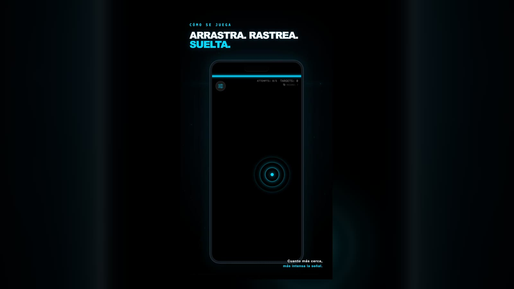
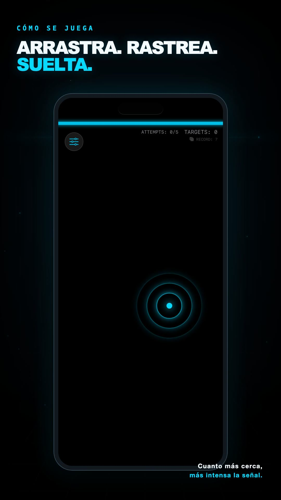
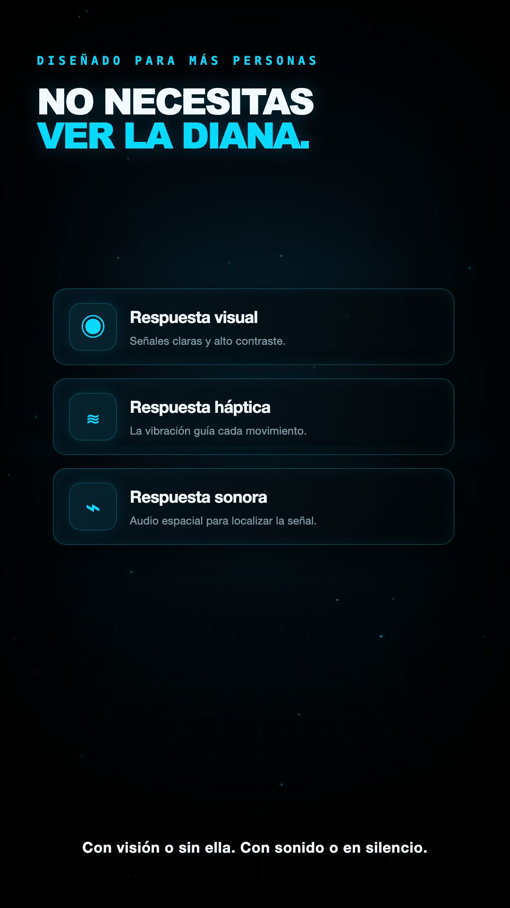

# Haptic Hunter

Accessible iOS signal hunting game designed so blind, deaf, low vision and sighted players share the same core game.

## Real gameplay

| Hunt | Sensory layers |
| --- | --- |
|  |  |

## Core idea

Direction, distance, lock and impact are carried in parallel through Core Haptics, dynamic audio and minimal light. A player can disable any channel without losing the information required to play.

## Modes

The app includes blind play with no required visuals, visual play with no audio, precision play and a daily challenge. The hunt can be completed with the screen effectively out of the interaction loop.

## Stack

SwiftUI, Core Haptics, AVAudio, Sign in with Apple, Supabase leaderboard migrations and native iOS accessibility APIs.

## Run

Open `haptichunter.xcodeproj`. Replace `YOUR_SUPABASE_URL` and `YOUR_SUPABASE_PUBLISHABLE_KEY` in `Info.plist` if leaderboard sync is needed. The game itself can be tested without private service credentials.

## Design decisions

Accessibility is the architecture, not a later mode. Redundant channels share one game state. Haptic curves were tuned by hand with the screen covered. Feedback always confirms both progress and failure.

## CA

Joc accessible per a iOS on el tacte, el so i la llum comuniquen exactament el mateix senyal. Funciona per a persones cegues, sordes, amb baixa visió i vidents.

## ES

Juego accesible para iOS donde el tacto, el sonido y la luz comunican exactamente la misma señal. Funciona para personas ciegas, sordas, con baja visión y videntes.
